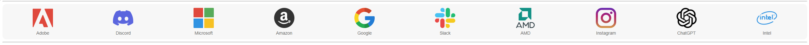
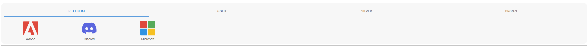
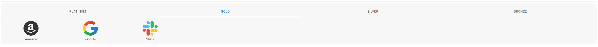
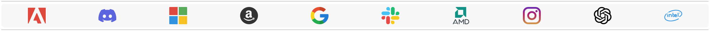
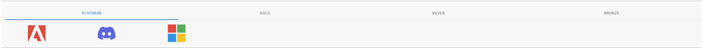

# React Sponsor Banner

A versatile and customizable React Sponsor Banner component built with Material-UI, featuring grid and marquee layouts, tier-based organization, and flexible styling options.

## ✨ Features

- **Multiple Layout Options**: Choose between Grid and Marquee layouts to display sponsors
- **Material-UI Integration**: Seamlessly integrates with your Material-UI themed applications
- **Tier Tabs & Labels**: Optional tier-based filtering with tabs (grid) or visual labels (marquee)
- **Marquee Animation**: Smooth scrolling marquee with configurable speed and direction
- **Clickable Sponsors**: Each sponsor logo can link to external URLs
- **Sponsor Names Display**: Optional sponsor name labels below logos
- **Fully Responsive**: Automatically adapts to mobile, tablet, and desktop screens with optimized layouts
- **Mobile-Optimized**: Touch-friendly interactions and responsive typography
- **Customizable Styling**: Control colors, spacing, fonts, borders, and more
- **Lightweight**: Minimal dependencies with optimized performance

## Screenshots/media

### Grid 

Grid without tier classification


Grid with tier classification



Grid without sponsor name


Grid with tier without sponsor name


### Marquee

Marquee with tier, with sponsor name
https://github.com/user-attachments/assets/7651ef90-8d95-45e4-aa64-32793b39ed68

Marquee without tier, with sponsor name
https://github.com/user-attachments/assets/b56a59c1-eade-41ec-b0ec-c71fed8aadcc

Marquee with tier, without sponsor name
https://github.com/user-attachments/assets/e9fa1ae5-2094-4bee-9a82-e1814035e0c3


## 🚀 Installation

First, install the package in your React project:

```bash
npm install @sadhus/react-sponsor-banner
```

or

```bash
yarn add @sadhus/react-sponsor-banner
```

This component relies on `react`, `react-dom`, `@mui/material`, and `@emotion/styled` as peer dependencies. Ensure these are also installed in your project:

```bash
npm install react react-dom @mui/material @emotion/styled
```

or

```bash
yarn add react react-dom @mui/material @emotion/styled
```

## 💡 Usage

**Important:** You must import the CSS file for the component to display correctly:

```jsx
import '@sadhus/react-sponsor-banner/style.css';
```

### Grid Layout Example

```jsx
import React from 'react';
import SponsorBanner from '@sadhus/react-sponsor-banner';
import '@sadhus/react-sponsor-banner/style.css';

const sponsors = [
  { src: "/logos/adobe.png", url: "https://www.adobe.com/", alt: "Adobe", tier: "platinum" },
  { src: "/logos/microsoft.png", url: "https://www.microsoft.com/", alt: "Microsoft", tier: "platinum" },
  { src: "/logos/google.png", url: "https://www.google.com/", alt: "Google", tier: "gold" },
  { src: "/logos/amazon.png", url: "https://www.amazon.com/", alt: "Amazon", tier: "gold" },
  { src: "/logos/intel.png", url: "https://www.intel.com/", alt: "Intel", tier: "silver" },
];

function App() {
  return (
    <SponsorBanner
      backgroundColor="#f7f7f7"
      borderRadius={12}
      columns={5}
      gap={24}
      layout="grid"
      maxHeight="100px"
      padding={12}
      responsive={true}
      showSponsorNames={true}
      showTierTabs={false}
      sortByTier={true}
      sponsors={sponsors}
      tierOrder={["platinum", "gold", "silver", "bronze"]}
    />
  );
}

export default App;
```

### Marquee Layout Example

```jsx
import React from 'react';
import SponsorBanner from '@sadhus/react-sponsor-banner';
import '@sadhus/react-sponsor-banner/style.css';

const sponsors = [
  { src: "/logos/adobe.png", url: "https://www.adobe.com/", alt: "Adobe", tier: "platinum" },
  { src: "/logos/microsoft.png", url: "https://www.microsoft.com/", alt: "Microsoft", tier: "platinum" },
  { src: "/logos/google.png", url: "https://www.google.com/", alt: "Google", tier: "gold" },
  { src: "/logos/amazon.png", url: "https://www.amazon.com/", alt: "Amazon", tier: "gold" },
];

function App() {
  return (
    <SponsorBanner
      backgroundColor="#fafafa"
      direction="left"
      gap={80}
      layout="marquee"
      maxHeight="100px"
      separator="|"
      showSponsorNames={true}
      showTierLabels={true}
      speed={50}
      sponsors={sponsors}
    />
  );
}

export default App;
```

## ⚙️ Props

| Prop | Type | Default | Description |
|------|------|---------|-------------|
| `backgroundColor` | `string` | `"transparent"` | Background color of the container. |
| `borderRadius` | `number` | `12` | Border radius of the container (in px). |
| `className` | `string` | `""` | Additional CSS class for the container. |
| `fontFamily` | `string` | `undefined` | Font family for the entire component (applied at container level). |
| `fontSize` | `string` | `"0.875rem"` | Font size for sponsor names and tier labels. |
| `gap` | `number \| string` | `16` | Gap between sponsor items (in px or any CSS unit). |
| `layout` | `"grid" \| "marquee"` | **Required** | Layout mode - either grid or marquee. |
| `maxHeight` | `string \| number` | `undefined` | Maximum height for sponsor logos. |
| `padding` | `number` | `12` | Padding inside the container (in px). |
| `showSponsorNames` | `boolean` | `false` | Whether to display sponsor names below logos. |
| `sortByTier` | `boolean` | `false` | Whether to sort sponsors by tier. |
| `sponsors` | `Array<{src: string, url?: string, alt?: string, tier?: string}>` | **Required** | Array of sponsor objects. Each sponsor should have `src` (image URL), optional `url` (click destination), `alt` (image alt text), and `tier` (sponsor tier). |
| `style` | `object` | `{}` | Additional inline styles for the container. |
| `tierOrder` | `Array<string>` | `[]` | Order of tiers (e.g., `["platinum", "gold", "silver"]`). |

### Grid-Specific Props

| Prop | Type | Default | Description |
|------|------|---------|-------------|
| `columns` | `number` | `undefined` | Number of columns in grid layout. |
| `responsive` | `boolean` | `true` | Whether grid should be responsive (uses minmax). |
| `showTierTabs` | `boolean` | `false` | Show Material-UI tabs to filter sponsors by tier. |

### Marquee-Specific Props

| Prop | Type | Default | Description |
|------|------|---------|-------------|
| `direction` | `"left" \| "right"` | `"left"` | Direction of marquee scrolling. |
| `separator` | `string` | `"\|"` | Separator character between tier groups. |
| `showTierLabels` | `boolean` | `false` | Show tier labels in the marquee. |
| `speed` | `number` | `60` | Speed of marquee animation (higher = faster). |

## 📋 Sponsor Object Structure

Each sponsor in the `sponsors` array should follow this structure:

```typescript
{
  src: string;        // Required: Image URL or path
  url?: string;       // Optional: Click destination URL (opens in new tab)
  alt?: string;       // Optional: Alt text for image (also used as sponsor name)
  tier?: string;      // Optional: Sponsor tier (e.g., "platinum", "gold", "silver")
}
```

## 🎨 Styling

The component comes with default styles but is highly customizable:

### CSS Classes

- `.rsb-container` - Main container
- `.rsb-grid` - Grid layout container
- `.rsb-marquee` - Marquee layout container
- `.rsb-link` - Clickable sponsor item
- `.rsb-tier-label` - Tier label in marquee
- `.rsb-tier-separator` - Separator in marquee

### Custom Styling Example

```jsx
<SponsorBanner
  backgroundColor="#ffffff"
  borderRadius={16}
  className="my-custom-banner"
  gap={32}
  layout="grid"
  padding={24}
  sponsors={sponsors}
  style={{
    boxShadow: "0 4px 6px rgba(0,0,0,0.1)",
    border: "1px solid #e0e0e0"
  }}
/>
```

## � Responsive Behavior

The component is fully responsive and automatically adapts to different screen sizes:

### Grid Layout Breakpoints

- **Mobile (≤480px)**: Auto-fit grid with minimum 80px columns
- **Tablet (481px-768px)**: Auto-fit grid with minimum 100px columns
- **Desktop (769px-1024px)**: Auto-fit grid with minimum 120px columns
- **Large Desktop (>1024px)**: Uses your specified `columns` prop

### Responsive Adjustments

- **Gap spacing**: Automatically reduces on smaller screens (16px → 12px → 8px)
- **Typography**: Font sizes scale down for better readability on mobile
- **Padding**: Container padding reduces to 8px on mobile devices
- **Touch interactions**: Optimized tap targets and touch feedback on mobile devices
- **Marquee**: Logo sizes and spacing adjust for smaller screens

### Mobile-First Design

The component uses CSS media queries to ensure optimal display across all devices. No additional configuration needed - it just works!

## �🛠️ Development

To set up the development environment:

1. Clone the repository:
```bash
git clone https://github.com/adityasrk/react-sponsor-banner.git
cd react-sponsor-banner
```

2. Install dependencies:
```bash
npm install
# or
yarn install
```

3. Run the development server:
```bash
npm run dev
# or
yarn dev
```

4. Build for production:
```bash
npm run build
# or
yarn build
```

## 📝 Examples

### Grid with Tier Tabs

```jsx
<SponsorBanner
  columns={4}
  layout="grid"
  responsive={true}
  showSponsorNames={true}
  showTierTabs={true}
  sortByTier={true}
  sponsors={sponsors}
  tierOrder={["platinum", "gold", "silver", "bronze"]}
/>
```

### Marquee with Tier Labels

```jsx
<SponsorBanner
  direction="left"
  gap={100}
  layout="marquee"
  separator="●"
  showTierLabels={true}
  speed={40}
  sponsors={sponsors}
/>
```

### Minimal Grid

```jsx
<SponsorBanner
  columns={6}
  gap={16}
  layout="grid"
  maxHeight="80px"
  sponsors={sponsors}
/>
```

## 📝 Important Notes

**Image Size Recommendations:**
- All sponsor logos/icons should be of **similar dimensions** for a consistent and professional appearance
- Use **smaller, optimized images** (recommended: 100-200px in height) for better performance and visual balance
- Ensure images have **transparent backgrounds** (PNG format recommended) for seamless integration
- **Square or similar aspect ratios** work best for grid layouts
- **Horizontal logos** (wider than tall) are ideal for marquee layouts
- Compress images to reduce file size without compromising quality

Following these guidelines will ensure your sponsor banner looks great across all layouts and devices!

## 🤝 Contributing

Contributions are welcome! Please feel free to open an issue or submit a pull request.

1. Fork the repository
2. Create your feature branch (`git checkout -b feature/AmazingFeature`)
3. Commit your changes (`git commit -m 'Add some AmazingFeature'`)
4. Push to the branch (`git push origin feature/AmazingFeature`)
5. Open a Pull Request

## 📄 License

This project is licensed under the MIT License. See the [LICENSE](LICENSE) file for details.

## 🙏 Acknowledgments

- Built with [React](https://react.dev/)
- Styled with [Material-UI](https://mui.com/)
- Developed with [Vite](https://vitejs.dev/)

## 📦 Keywords

- react
- sponsor-banner
- sponsor-grid
- marquee
- grid-layout
- branding
- marketing
- sponsors
- tier-based
- material-ui
- mui
- vite
- component
